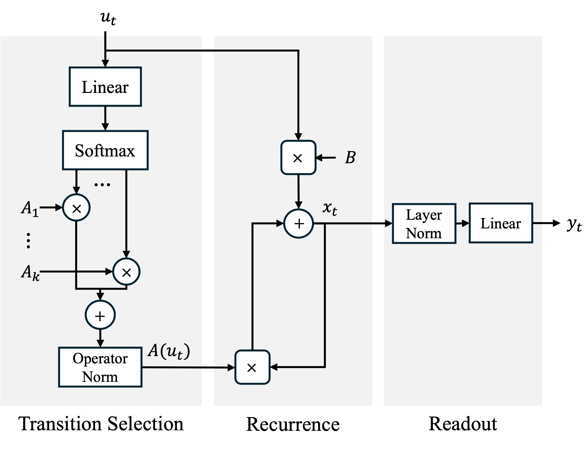

# On the Expressiveness and Length Generalization of Selective State-Space Models on Regular Languages

### Aleksandar Terzić, Michael Hersche, Giacomo Camposampiero, Thomas Hofmann, Abu Sebastian, Abbas Rahimi

Association for the Advancement of Artificial Intelligence (AAAI) 2025, [Preprint](https://arxiv.org/abs/2412.19350)

<div align="center">
  
</div>

## Requirements

The `conda` software is required for running the code. Generate a new environment with

```
$ conda create --name sdssm_env python=3.10
$ conda activate sdssm_env
```

We used PyTorch 2.5.1 with CUDA. jax and jaxlib are required for the sample generation for the _Arithmetic_ task. 

```
$ (sdssm_env) conda install pytorch torchvision torchaudio pytorch-cuda=12.1 -c pytorch -c nvidia
$ (sdssm_env) pip install -r requirements.txt
```

## Experiments

The experiments should be run from the repo directory. Results will be stored in the _results_ directory, unless specified otherwise by using the --experiment_dir flag.

Before running experiments, please modify the main directory name to 'selective_dense_state_space_model' by running the following command from the parent directory:

```
$ (sdssm_env) mv selective-dense-state-space-model selective_dense_state_space_model
```

### SD-SSM

For reproducing the best _SD-SSM_ results from Table 1, use the following commands from the main directory:

```
# Parity:
python experiments/run_experiment.py --architecture=SDSSM --test_length=500 --task=parity_check --lr=0.0001 --seed=0 --num_transition_matrices=8 --Lp_norm=1.2 --train_steps=1000000 --state_size=64 --train_length=40 --use_query_token=true

# Even Pairs:
python experiments/run_experiment.py --architecture=SDSSM --test_length=500 --task=even_pairs --lr=0.00002 --seed=0 --num_transition_matrices=8 --Lp_norm=1.4 --train_steps=1000000 --state_size=64 --train_length=40 --use_query_token=true

# Cycle 
python experiments/run_experiment.py --architecture=SDSSM --test_length=500 --task=cycle_navigation --lr=0.00002 --seed=0 --num_transition_matrices=8 --Lp_norm=1.3 --train_steps=1000000 --state_size=64 --train_length=40 --use_query_token=true

# Modular Arithmetic
python experiments/run_experiment.py --architecture=SDSSM --test_length=500 --task=modular_arithmetic --lr=0.0001 --seed=1 --num_transition_matrices=18 --Lp_norm=1.2 --train_steps=1000000 --state_size=64 --train_length=40  --use_query_token=true

# C2 x C4
python experiments/run_experiment.py --architecture=SDSSM --test_length=500 --task=C2xC4 --lr=0.00002 --seed=2 --num_transition_matrices=6 --Lp_norm=1.1 --train_steps=1000000 --state_size=64 --train_length=40

# D4
python experiments/run_experiment.py --architecture=SDSSM --test_length=500 --task=D4 --lr=0.00002 --seed=0 --num_transition_matrices=6 --Lp_norm=1.1 --train_steps=1000000 --state_size=64 --train_length=40

# A5
python experiments/run_experiment.py --architecture=SDSSM --test_length=500 --task=A5 --lr=0.00002 --seed=0 --num_transition_matrices=6 --Lp_norm=1.3 --train_steps=1000000 --state_size=64 --train_length=40  
```

### Complex Diagonal

For reproducing the best _Complex Diagonal_ results from Table 1, use the following command with the appropriate choice of task and learning rate:

```
# Cycle
python experiments/run_experiment.py --architecture=complex_diagonal_with_B_nonlinear --test_length=500 --task=cycle_navigation --lr=0.001 --seed=2 --train_steps=1000000 --state_size=64 --train_length=40
```

### Inspection with TensorBoard

For an overview of the training metrics and the length generalization accuracies, the TensorBoard tool can be used. During simulations, data is collected which can be illustrated by the tool in the browser. 

## Acknowledgments

This repository is heavily inspired by the [Neural Networks and the Chomsky Hierarchy repo](https://github.com/google-deepmind/neural_networks_chomsky_hierarchy) and the automaton generating code associated with [Transformers Learn Shortcuts to Automata](https://huggingface.co/datasets/synthseq/automata/tree/main).

## Citation

If you use the work released here for your research, please cite this paper:
```
@misc{terzic2024sdssm,
      title={On the Expressiveness and Length Generalization of Selective State-Space Models on Regular Languages}, 
      author={Aleksandar Terzić and Michael Hersche and Giacomo Camposampiero and Thomas Hofmann and Abu Sebastian and Abbas Rahimi},
      year={2024},
      eprint={2412.19350},
      archivePrefix={arXiv},
      primaryClass={cs.LG},
      url={https://arxiv.org/abs/2412.19350}, 
}
```

## License
Our code is licensed under Apache 2.0. Please refer to the LICENSE file for the licensing of our code. 